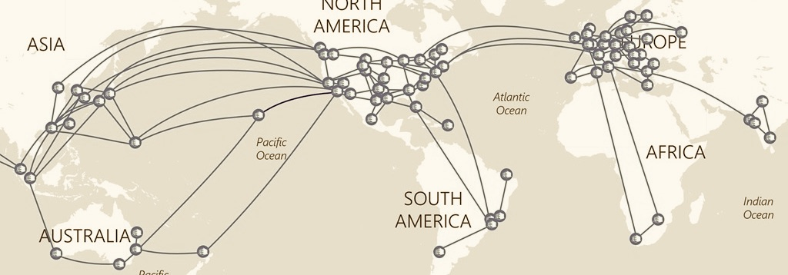

# Contacting Us

If you are a Cloud Computing Fellowship participant this year (or past participant!), please contact the instructors [Pat Bills](mailto:billspat@msu.edu) or [Mahmoud Parvizi](mailto:parvizim@msu.edu) with any issues or questions related to the material or activities.  

The [session meetings](https://msucloudfellowship.github.io/#schedule-for-fall-2021) are designed to have plenty of time for questions, troubleshooting and discussion.   We will also schedule office hours prior to meeting times to help with pre-meeting activities. 

If you have general questions about the MSU Cloud Computing Fellowship, please contact [Brian O'Shea](mailto:oshea@msu.edu) or [Danielle Barnes](mailto:barnesd8@msu.edu)

If you will be an MSU graduate student or post-doc in Fall 2022 and are interested in participating next year, please check back in the Summer of 2022 for announcements for invitation to participate, or request to join the [MSU ICER mailing list](https://icer.msu.edu/getting-latest-hpcc-updates)

If you are an MSU Researcher interested in using cloud for your research, please contact [IT Services](https://tech.msu.edu/network/cloud-services/) or [MSU ICER](https://contact.icer.msu.edu) via our ticketing systems and describe your needs.   
