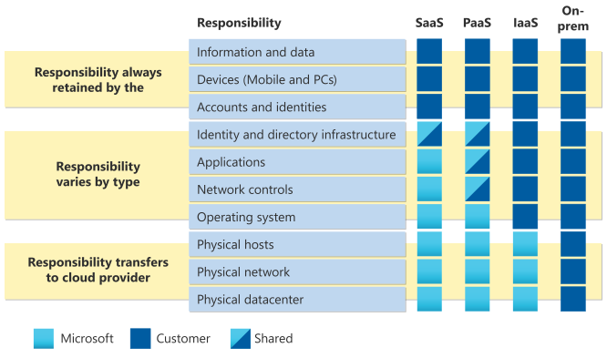

# Practical Introduction for Researchers on Azure

## Introducing cloud computing vs. research computing

### Learning how to learn about cloud

You may have looked at the various websites and poked around the web, and found it's just not clear at all how cloud computing may be helpful to you, even though it all sounds great.  The challenge for researchers learning about cloud is that most cloud documentation for isn't written for you.  

Cloud training and documentation are mostly written for IT professionals like system admins and architects, software developers, business people, and agency managers.  Researchers tend to be a little of all of those things.   

Training materials ofen have an embedded  conceptual models of computing, and this model depend on your approach.  Our goal as researchers is to get our work (or the work of our lab) done, not to build systems used by hundreds of people or for business purposes.   That can make it difficult to decipher which kind of cloud service will work best for your use case.   As Dr. Parvizi writes, cloud is very different from using traditional research-oriented technology like workstations or HPC.   There are hundreds of services to choose from but we find many researchers will reach for the conceptually straightfoward path of creating cloud computers and install what they need.   Our goal for this fellowship is to provide context and background, and help you explore some of the so-called "cloud native" technologies like "serverless" systems that let you run your scripts without dealing with operating system installs. 

The target audience for most cloud companies are IT professional building IT systems for public or institutational use.  Let's call this the "Systems" perspective:

  - built for someone else to use, e.g. a service
  - must be available at scale and ultimately reliable
  - documentation is in terms of historic IT systems house in on-premise corporate data centers 
  - "production" systems
  - often very concerned with authentication and security

The second audience are corporate software engineers, or dot-com or app software companies. We'll call this the "developer
 perspective

  - need to easily create systems to run their software for demonstration and testing 
  - complete interelate
  - goal is a robust sytem that can handle many users, e.g. the performance of a "production" systems are often top of mind

And finally most closely related to your work are data science, "machine learning" or an "analytical" perspective

  - systems to achieve computation.  
  - May work like our local HPC
  - systems built only for small work groups, not for public 
  - can still scale 
  - but must be reproducible to document methods
  - even this documentation can quickly veer off in to building production systems for companies to re-run inference say many times a data or with a constant stream of corporate data

What is are the goals from research perspective for cloud computing?

  - Custom: can create customized resources only when you need it
  - On-demand: can run ad-hoc computations on those on-demand resources
  - Reproducible: a computation can be re-run as needed, meaning cloud resources can be easily re-recreated to re-run your computations. 
  - Cost effective: unlike commerical applications, more users does not mean more revenue.   Budgets are fixed and the pay-as-you-go model requires vigilance to not over-spend.   
  - Others? <!-- discussion -->

#### What documentation *is* available for researchers?

There are general, conceptual introductions and dicussions for academics.   

  * https://cloud4scieng.org/  Book and website from Ian Foster and Gannon (U. Chicago), the text used for this fellowship. 
  * https://cloudmaven.github.io/documentation/  from the eScience institute of the University of Washington.   It doesn't appear to be maintained but may have some good resources.  Original github repositories are https://github.com/cloudmaven
  * https://cloudbank-project.github.io/cb-resources/  Seems to be a succesor to the 'cloudmaven' documentation above as members from cloudmaven are contributing here. 
     * [Cloudbank training videos](https://www.cloudbank.org/training/getting-started-using-cloud)

#### NIST defintions of cloud: Service Levels and You

The [NIST definition of cloud computing](https://nvlpubs.nist.gov/nistpubs/Legacy/SP/nistspecialpublication800-145.pdf) defines service models, but what does "X as a service" actually mean, and where are the lines drawn?   Like the species concept in biology, it's not always cut and dried, but can be thought of as a spectrum

* Infrastructure (aaS):  Nuts and bolts, DIY, Lego.  You need understanding of computing architecture as these services 
* Everything in between:  Platforms or pre-configured and managed infrastructure
* Software (aaS): Little to no configuration is needed but these system may be programmable and integrated with other services.  E.g. Office 365, Google Drive

The sweet-spot for researhces who do not have time to aquire the expertise to manage low-level infrastructure and need something more flexible and programmable than Software, are the platforms.  These are often more expensive than DIY infrastruture, but are faster to provision and provide security controls. 

#### Cloud "Services" and the Packaging of Open Source Systems

Case Study on Open Source system as Cloud service: **MySQL **

Open source, free Relational database, e.g. SQL. Relational databases store tabular, linked data.   Used by some bioinformatics packages (e.g. https://orthomcl.org/orthomcl/app) and millions of websites. 

  * project: https://www.mysql.com/products/community/ and  https://mariadb.org/
  * DIY on Azure instructions (eg Iaas): [someone's DIY Mysql](https://github.com/Huachao/azure-content/blob/master/articles/virtual-machines/virtual-machines-linux-install-mysql.md) - don't follow these, they are old and may not work, just an example of the steps involved
  * Azure MySQL Service (e.g PaaS): [Azure Database for MySQL](https://azure.microsoft.com/en-us/services/mysql/) 
     * AWS MySQL Service: [Amazon RDS for MySQL](https://aws.amazon.com/rds/mysql/)
     * Google MySQL Service [Cloud SQL](https://cloud.google.com/sql/) 
  * other companies, such as [Aiven for MySQL](https://aiven.io/mysql)

  * Spin-offs: Amazon also offers [AWS Aurora](https://docs.aws.amazon.com/AmazonRDS/latest/AuroraUserGuide/CHAP_AuroraOverview.html)  which is a cloud scale database service that is MySQL-compatible see [Amazon Aurora Paper](https://dl.acm.org/doi/10.1145/3035918.3056101) 

What would a "SaaS" offering for tabular data look like?  A "Google Docs" for Databases?  Perhaps [https://www.airtable.com/](https://www.airtable.com/) ?

#### Caveats and help

As part of this fellowship, our goal is to help you translate documentation written for the systems and developer perspectives into a research perspective.  

  * The cloud services themselves are always changing, even slightly, making technology-specific tutorials obsolete in months.  For example last year Azure had a "Notebook Service" for running Python notebooks, and now there is this  in place of the regular documentation: [What happened to Azure Notebooks?](https://docs.microsoft.com/en-us/azure/notebooks/quickstart-export-jupyter-notebook-project)
  * There are new services and bundles created all the time that may be competing or superior choices for doing research
  * If you are unsure, ask us.  See the [contact page](../contact.md) or use our Teams channel.   During the Cloud Computing Fellowship we are here to provide some answers, context for what you are seeing, or possible directions to explore.  
  * Cloud companies have help desks and many resources for anyone using their services or potential customers and we may be able to connect you with those. 

## The Interfaces to Cloud 

A defining aspect of cloud computing is that it's "on-demand" hence creation of resources must be automated or "scriptable."  All Cloud providers have various 'interfaces' to their services that include both programmatic and web-based.   We will talk about about how these in detail next sesion, but at the end of this session we will do a walk through of using the Azure portal, which is also an exercise for next session.  

## Using workflow and computational thinking 

Karl Popper stated that "non-reproducible single occurrences are of no significance to science" ( *K Popper, "The Logic of Scientific Discovery", English translation from Routledge, London, 1992, p. 66.*) and this is a significant issue for research computing and one of much academic work. 

To enhance reproducibility in your own work, consider documenting all the steps needed for create the environment to run your computation.   For many on-premise academic systems (e.g. the MSU HPCC), we depend upon the system administrators to create that environment, but we may install and configure all the software we need to run our code.   Workflow thinking can apply to the scienfic domain itself (e.g. "Principles for data analysis workflows" https://journals.plos.org/ploscompbiol/article?id=10.1371/journal.pcbi.1008770 )  and to the provisioning of the cloud computing environment.   That is, we may use a workflow system for creating all the cloud stuff we need, and then a different workflow system that runs on that cloud stuff.   One example is we may [create an HPC system on Azure using templates](https://azure.microsoft.com/en-us/resources/templates/create-hpc-cluster/) and then launch the Slurm scheduler on that HPC to run our jobs.  (*note the complexity of running our own HPC is beyond the scope of this fellowship and used as an example only*)

A major advantage to using workflows or code for provisioning your cloud computing components is that you can turn them off and delete them when you are done, and restart when needed.   This can dramatically save on costs  <!--  example for a gene network ML inference : a machine to run the ML would be $650/month, but if provisioned only when needed, it's 5 cents/job -->.   This does not necessarily have to be a complete programming system, but some combination of well written instructions and a collection of scripts so that your colleague (or yourself 6 months from now) can recreate everything you need.  

## About Cloud Security

Security and Risk management is an important issue even for researchers who's data may not be sensitive or even open source.   Attackers  may use the services you create to launch attacks on other services, leaving you liable.  

Finding a readable list of security recommendations for cloud computing is a challenge for all the reasons outlined above.  Our textbook has [a nice chaper outlining cloud security](https://s3.us-east-2.amazonaws.com/a-book/security.html)

The "Shared responsibility" model for cloud computing takes a model of computing components, and shows how much of each component the user is responsible for security:

*[Microsoft Model of Shared Responsibility for Cloud Computing](https://docs.microsoft.com/en-us/azure/security/fundamentals/shared-responsibility)*

We will come back to this model as we gain deeper understanding of research computing on the cloud.  

## Costs and Budget overview

We will cover the details of pricing, examine costs, and controlling costs in future sessions.   Each participant has a budget for their Azure resources that they should stay under.   If you need to use Google or AWS we need to make additional arrangements but your first step would be to acquire a free starter account with these companies (e.g. using a gmail address). 

Briefly: 

  * Costs are more than just dollars for services.  Consider `[Total Cost] = ( $ + Time + Risk )`
  * `[Total Time] = ( development time + wait time + compute time ) `
  * Risk is rarely non-significant.  Never say "I won't get hacked..."
  * In the Service level spectrum, the higher level "platform" services may have higher monetary costs but often reduce time and risk

## HPCC vs Cloud

Dr. Parvizi's white paper outlines the challenges of adapting HPC workflows to cloud computing.  

The HPC is amazing effective at running all kinds of systems at very list cost, if any, to MSU researchers.  Many systems not designed for HPC can be adjusted to run in that environment.  However, just like many workflows are difficult to port from HPC to cloud, some cloud workflows are difficult run on HPC (but never say never):

- Big Data systems (see magpie project)
- Long-running Data Systems like database servers
- Web-based applications (see on-demand project)
- Containers (see singularity project)

## Acknowledging bias in access to cloud computing across research cultures

## Additional comments from instructors and organizers

Summary and additional comments

<!-- summary: freely explore cloud services using the portal as there are often free-tiers; try the programming interfaces  at least once as this will make your work reproducible ; security is always a concern and consideration of cost ; look to the higher level services, even though more expensive may be faster to results and more secure --> 

