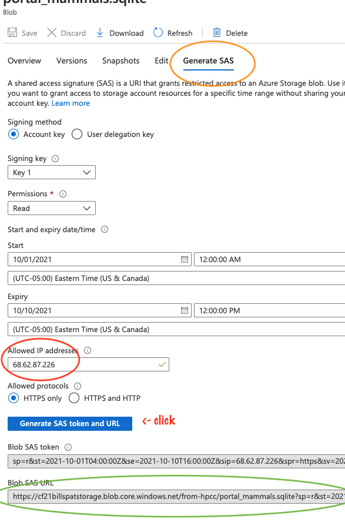

# Exercise: moving data using storage URL

The goal of the exercise is to show one of the many ways of get data out of your cloud storage account, 
especially as way to share a file using a URL

1. Upload a file to cloud storage. 

get a file, any file and get it into cloud storage in any way you like.  If you already have a file in 
Azure Blob storage container, you can skip this step.  If you want to use Storage Explorer that works, too.  
For the sake of complete and consistent exercise, we will use a small file and upload it with the portal. 
(I don't recommend this for large files for for many files)

### Upload file via portal

1. Find a data file in any format on your computer.   Let's called it `mydata.txt`
1. Open the Azure portal and go to your storage account in your resource group
1. In your storage account create container, if you don't want to use an existing container
    1. click "containers" on the left side menu
    1. above the list of containers is a "+" icon, click that to create a container
    1. For Name, call it "democontainer"
    1. For public access level, leave it as "private"
1. Open the container in the portal
1. click "the upload" link near the top
1. select a file to upload- any file will work for this excercise

### Get a URL to download this file back to your own laptop (or a different computer)

1. determine your laptop's IP address
  1. Google "what's my IP address"
  1. copy it or save that IP address for later
  To share with a colleague you'd use their IP address for this step

1. click on the file you just uploaded and a new form appears on the right
1. on that form is a link near the top "generate SAS"  - click that link
    - for more details, see documentation [Creating Container SAS](creating_a_container_sas_token_from_the_azure_portal.md)
1. Leave all form fields as they are, except in the "allowed IP addresses", put your computers IP you just got
1. Click the "Generate SAS ...URL" button
1. Copy the Blob SAS URL to the clipboard

### Test Download

In a web browser, paste the URL to see if you can re-download your own file. 

To share with someone else, put in a new IP address in the form above, and click "Generate SAS..." to get a new URL

