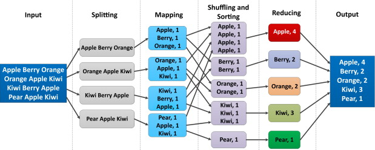

# Session 5: Big Data on Azure Cloud Featuring Spark

You may have heard of 'Big Data' as a concept, which is a complex topic and at the heart of data science, introduced by Google in 2004.   "Big Data" processing generally means building a cluster of computers to apply parallel techniques to both store and analyze huge amounts of data.  

Big data is truly big: hundreds of billions of datapoints or graphs with billions of edges, petabytes of data (1000 Terabytes).   However many of us more modest data sets find they are large enought that we can't work with them on our laptops or even a very a large computer.  To accomplish our data 
processing task we look for ways to split up the work with parallel methods.  Modern big data tools offer this possibility without resorting to  
custom coding or manually processing.   

While big data technology doesn't require cloud computing, most cloud companies have a services that provide data processing clusters with a few clicks.  The goal of this single session is introduce you to basic concepts of  'big data' processing and peek at how it works and what it may do for you.   Your Python or R script Many applications can't take advantage 
of it of big data, or they have their own parallel systems.  for those that it could help, it may save tremendous amount of time and make your research more repoducible than DIY data partitioning that requires manual handling. 

## Videos

1. [Using Azure Databricks](https://mediaspace.msu.edu/media/Using+Azure+Databricks+by+Doug+Krum+2021/1_etunq5g9) Doug Krum, Data Architect, Analytics and Data Solutions, MSU IT Services.    ( MSU log-in required for video)
2. [Using Azure Databricks Part 2: Demonstration with Python](https://mediaspace.msu.edu/media/Using+Azure+Databricks+Part+2A+Demonstration/1_tsi9kyxp) Doug Krum, Data Architect, Analytics and Data Solutions, MSU IT Services.    ( MSU log-in required for video)

*These are detailed explanations of the commercial version of Apache Spark from the Databricks company, and exactly how to create and use a Databricks cluster on Azure to run Python code*

## Readings

Slide Deck: [Overview of Big Data with Spark for Researchers](big_data_intro_for_researchers.html)

[Tools And Technologies For The Implementation Of Big Data, Richard J. Self, Dave Voorhis](https://michiganstate.sharepoint.com/sites/MSUICERCloudFellowship2/Shared%20Documents/General/Materials/TOOLS%20AND%20TECHNOLOGIES%20FOR%20THE%20IMPLEMENTATION%20OF%20BIG%20DATA_Self_Vorhis%20CH10%20DO%20NOT%20DISTRIBUTE.pdf)Chapter 10 from "Applications of Big Data for National Security." http://dx.doi.org/10.1016/B978-0-12-801967-2.00010-0 
Copyright © 2015 Elsevier Inc. All rights reserved.

*PDF copy, for use by Cloud Computing Fellowship only (link is access restricted).  The book is available as an [electronic copy from the MSU Library](http://catalog.lib.msu.edu/record=b11321901~S39a)*

While the book itself is really not of interest to us, this particular chapter is one of the better and more readable introductions to "big data" I've seen, written for professionals like yourselves.    Dr. Self studies ethics and big data for University of Derby in the UK. 

**Textbook: Cloud Computing for Science and Engineering**

 - [Chapter 7 "Scaling Deployments"](https://s3.us-east-2.amazonaws.com/a-book/scale.html), **only** sections *7.4 "MapReduce and Bulk Synchronous Parallelism"* and *7.5 "Graph Dataflow Execution and Spark."*  
   This chapter discusses parallelism and begins with a focus on High Performance Computing (HPC).  If you are familiar with HPC, feel free to read the entire chapter which may help put "big data" in context for you (it did for me).   

 - [Chapter 8 "Data Analytics in the Cloud"](https://s3.us-east-2.amazonaws.com/a-book/analytics.html) 
   This is a technical introduction to big data including the first open source program "Hadoop" followed by "Spark"  We will only concentrate on spark for this session as it's much more approachable and more modern.   There are a handful of examples, but example 8.2.1 should be approachable any one with exposure to college-level Math (approximating Pi using infinite series)

[Introduction to Apache Spark](https://docs.microsoft.com/en-us/azure/databricks/getting-started/spark/) part of the **Azure Databricks Documentation**
*This is the intro to an excellent tutorial on using Apache spark with Azure.  Read the introduction only (see activities below for info on the tutorial)*

### For R users

The Spark big data system we introduce above is focused on Python and it's native language (calls "Scala").  However you _can_ use R commands with Spark, and Databricks has the option of creating an R-based notebook.   Note this notebook is more similar to Python/Jupyter notebooks than Rstudio notebooks, but is an easy way to interactivtly issue  R commands.    Follow the video above up to entering commands in a notebok, and instead of python, select an R notebook.  

The easiest way to use R with Spark is with the package [sparklyr](https://spark.rstudio.com/) from Rstudio.  

"Mastering Spark with R" hosted on https://therinspark.com/ is a free book is very readable and comprehensive resource for learning all about big data focused on R and Spark. 

- This is a full book, so only suggested reading for those who deecide to use Databricks/Spark with R in their projects.  The book above describes how to use it in great detail. 
- As described in the video and slides above, Databricks is a commercial version of the open source Apache Spark, and the free/open version of Spark can be installed on a laptop for testing without Databricks.  The book has details for that. 
- While it does not describe how to install databricks, all of the examples are useable in an R notebook in Azure databricks
- The code you develop with Spark on your laptop can be moved to a cluster built in the cloud. 

In addition to putting using R in Jupyter style notebooks, you can install and run a web-version of Rstudio inside of Databricks to get the full features of spark inside Rstudio.  It requires some setup, see [RStudio on Azure Databricks](https://docs.microsoft.com/en-us/azure/databricks/spark/latest/sparkr/rstudio) from Microsoft.  

## Activities

There are dozens of tutorials related to databricks / Apache spark which is a complex product with many ways to access. This is a curated list 
geared towards researchers

[Create an Azure Databricks workspace](https://docs.microsoft.com/en-us/azure/databricks/scenarios/quickstart-create-databricks-workspace-portal?tabs=azure-portal#create-an-azure-databricks-workspace)  which is part of [Quickstart: Run a Spark job on Azure Databricks Workspace using the Azure portal](https://docs.microsoft.com/en-us/azure/databricks/scenarios/quickstart-create-databricks-workspace-portal?tabs=azure-portal).   The quickstart 
tutorial is based on running SQL (database structured query language) which may not be useful if you have not familiarity with SQL

[Introduction to Spark Data Frames with Python and SQL](https://docs.microsoft.com/en-us/azure/databricks/spark/latest/dataframes-datasets/introduction-to-dataframes-python)

A job is a way to run non-interactive code in an Azure Databricks cluster.   Doug Krum discusses using Jobs in the videos above.  For details about Jobs and how they work, see [Databricks Data Science & Engineering: Jobs](https://docs.microsoft.com/en-us/azure/databricks/jobs)  or to simply try a quick example see 
[Running Jobs in Databricks Quickstart (with Python)](https://docs.microsoft.com/en-us/azure/databricks/data-engineering/jobs/jobs-quickstart)

 
