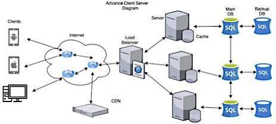
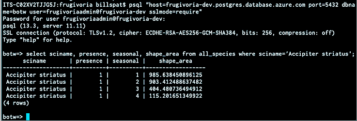
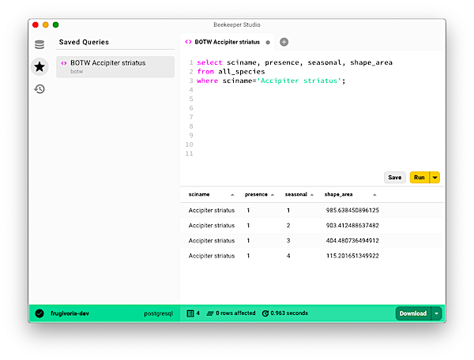
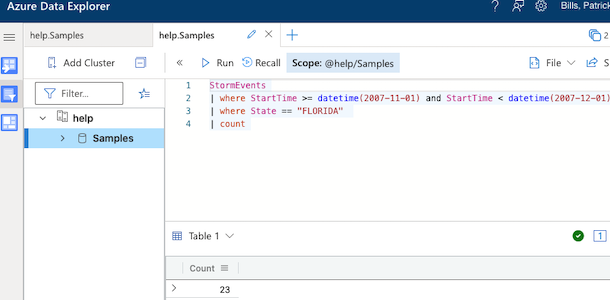
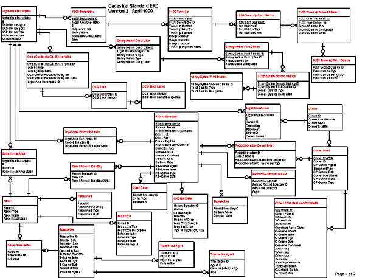

<!DOCTYPE html>
<html>
  <head>
    <title>Overview of Data Servers and Databases on the Cloud for Researchers</title>
    <meta charset="utf-8">
    <style>
      @import url(https://fonts.googleapis.com/css?family=Roboto:100,400,500,400italic);
      @import url(https://fonts.googleapis.com/css?family=Droid+Serif:400,700,400italic);
      @import url(https://fonts.googleapis.com/css?family=Ubuntu+Mono:400,700,400italic);

      body { font-family: 'Roboto'; font-weight: 400;}
      h1 {
        font-family: 'Roboto';
        font-weight: 100;
        font-size: 40px !important;
      }
      h2, h3 {
        font-family: 'Roboto';
        font-weight: 500;
      }
      .remark-code, .remark-inline-code { font-family: 'Ubuntu Mono'; }
      .remark-container { background-color: lightblue}
    
      .cloudtitle { background-image: url('../img/chuttersnap-9AqIdzEc9pY-unsplash.jpg');
          background-repeat:no-repeat;
          background-size:contain;
      }
    
    </style>
  </head>

  <body>
    <textarea id="source">


class: cloudtitle,center, middle

# Data Servers on the Cloud for Researchers

### Pat Bills, IT Services ADS

for the [MSU Cloud Computing Fellowship](../session_datasystems)

---

# Again, Why are we talking about Data?  

**Session Goal:** understand the principles, how and why to use data servers in your research
- we all have data to deal with
- a common research struggle is working with complex data, or collaborating with others
- Databases can offer a solution for collaboration among researchers and parallel processes
- cloud computing offers Data servers  "as a service" (PAAS)
  - without cloud these systems require a collection of hards, a month of installation, infrastructure expertise
- Databases are common place in industry and have been used by researchers for decades
- Potential gateway to whole new realm of solutions for data workflows

---

# Client/Server architecture

- designed in the 1970s, common-place now
- client does very little processing, used to send/receive messages
- server houses all the data and processing power
- now clients are apps and many have significant prrocessing power (chrome)
- Most Research workflow:  download data and process it on our machine


---

# What is a server?

 - Running Program
 - listens on specific port
 - accepts messagess that match it's protocol/format
 - optionally include mechanism for secure authetication 
 - sends messages and data back using same protocol/format

---

# What is a server? web server example

- listens for and accepts messages using the 'http' protocol (on port 80)

- the http protocol tells  the web server which content to fetch (via the URL), and what formats the client can use (html)

- the server returns a message indicating the format of the content (html, PDF, etc), other info, and the content itself

-  the browser client determines what to do convert the content to something you can  read 

  

---

# Clients and Servers

each server requires a specific protocol, so typically you can't mix clients and servers BUT

 - some clientss are smart and can alter protocol to work with multipel server
 - some sereves are smart and can respond to differnet protocols.   A data serever rmay have a webs interface

For example, many database clients can communicate with many flavorrs of SQL dataabases

- communication protocols are text and binarry, and client apps provide GUIs of those 
- servers accept commands, programs, or data, formatted in propeer protocol
- clients let you type to thee commands and format into th eprotocol for you

---

# Client/Server Connections

- `user -> connects to server host -> enters commands -> 
client formats and sends  ---> server accepts commands --> run process and returns value`

- `user <-- client displays results <- client accepts results and displays`

- communication can be about data, but also about server configuration, client output format, etc


---

# Client/Server : essential for data systems

This session is focused on data systems that use a client/server model but we use services every day
- email
- remote desktop : the 'server' is a windows programs that returns views of the screen
- most apps ( I have to use on to remote start my car )
- others?  



---

# Cloud was made to  serve

The cloud was invented to host servers

Large institutions have to run servers for many aspects of their work  in addition to data


# Steps for Client-Server-ing

1. install a server
   - physical machine or a VM that is running server software
2. configure server
   - network, securrity, user aaccounts, storagee, server prefs/config
   - use managed cloud service (restuarant) 
3. install client
   - download any number of compatible programs

---


---

# Server Connection Terms

- *host*: computer that runs the server software "host" and id by it's internet address
- *port*: too allow muliple servers linux has 65K ports
- *user vs admin*  : accounts on the server , admin has full power, user limited.  For DIY server, you are the admin
- *database vs server* : a "database server" can have multiple "databases" becuase servers are typicaly shared
- *SSL* : secure sockets layer required to encrypt the communication for security, Azure takes care of this
- *Connection string* : the combination of these parameters used to connect to a database, formated for the Client
- *Client* : can be a package or library used inside a programming language

---

# Server Locality

*Servers can run anywhere*

 - on your laptop, running alongside your other  programs.  The *host* is called `localhost`   
 - on a computer on campus (on-premise) the host is something like myservername.mydepartment.msu.edu 
 - on a VM that you create in the cloud :  myvmname.east.azure.net (IAAS)
 - as part of a service offerring, provisioned for you (PAAS)
 - the service itself, you don't control the server, only access data serevices (SAAS)

# 

# Example session : terminal client

#### Demo of Terminal session to Postgresql Server

 - Create a Azure Postgresql Database Server
 - Connect to the server with a command line interface



---

# Example Session : GUI client

  #### Demonstration using a free Graphical Client to connect to a Postgresql Database hosted on Azure

  

---

# Example Session : Scripting Client


# Example Data Command Language: SQL

- Structured Query Language for Relational Databases
- by far most common data processsing language since 1970s
- declarative not procedural
  - like ordering from a restaurant - you state what you want, with no direction for how to prepare
- easy to learn and use and use the basics
- like other Data Command languages, based the data model 
= tabular data, linked on common ID values.  

---

# Example Data Command Language: SQL

This is not a course on SQL but for Example to return rows of a table

- *SELECT* the columns to show 
- *FROM* the table 
- **WHERE** a logical condition to match data in the rows
- ordering

 list some data for all flights for today in the US: 

 ```
 SELECT flight_num, airport_code, airline, takeoff_time, aircraft_id 
 FROM flights WHERE fight_date = '2021-10-28' and country='US'
 ```

1. - 

---


---
# Cloud-scale Database Services

We covered a "Big Data" system last seesion (Spark) but cloud companies provide a data service for really big data.  These are proprietary, on-of-a-kind systems that can work on truly huge amouts of data

- Google BigQuery (google invented the concept and unbelievable huge)
- AWS Redshift
- Azure ComosDB
- Azure DataExplorer aka Kusto

do not need to provision any resources, only an "account" in which you can store your data, queries/scripts, and the output.   Data storage is inside the db and  output can be exported to cloud storage in various formats 
- SAAS for large database

---

# Cloud-scale Database Services: Azure Cosmos DB

- Primarily a NoSQL database, but has a SQL API to make it easy
- Compatible with other common open source NoSQL database "MongoDB"
- Getting data ingested requires using a windows program, or using Azure DataFactory to move data from Cloud storage into Cosmos DB
- Could be useful if you are analyzing a very large amount of semi-structured data that may already be in JSON format and don't want to manage a big data system like Databricks. 
- Resource [Introduction to Cosmos DB](https://docs.microsoft.com/en-us/azure/cosmos-db/introduction) and the Azure [Quick Start using Cosmos DB](https://docs.microsoft.com/en-us/azure/cosmos-db/sql/create-cosmosdb-resources-portal)

---

# Azure Data Explorer : Analytics as a Service

<!--  -->

[Data Analytics Service on Cluster Computing  aka *"Kusto"*](https://docs.microsoft.com/en-us/azure/data-explorer/data-explorer-overview)

- Useful for fast analytics of large data without provisioning a server
- Data is read-only and  can't be changed. 
- SQL-like query language called KQL unique to Kusto: [Overview with link to free example](https://docs.microsoft.com/en-us/azure/data-explorer/kusto/query/)
- Create a cluster: https://portal.azure.com/#create/Microsoft.AzureKusto then use https://dataexplorer.azure.com/ 


---

# Google Detour


#### We could use a collection of Google services to accomplish data analytics on the cloud: 

- Google Drive: Files as a Service
- Google Colab: Python/R/SQL as a Service : free notebooks hosted in Google Drive`
- Google BigQuery : Data query as a service

<br>

- [CoLab Example (PSB's drive)](https://colab.research.google.com/drive/1e_nObJODQ61-0NtaMI-jlEvT9eHgvkmd)
- [Weather Tutorial using Google Services](https://cloud.google.com/blog/products/data-analytics/whats-the-weather-like-using-colab-to-get-more-out-of-bigquery) 
   that access huge public dataset demonstrates the power of this approach

#### *Google Colab + Google BigQuery + GoogleDrive*
 - definitely cloud computing 
 - is it cloud computing in the way we think about it?

---

# Cloud Serivce Levels and Responsibility

- any server connected to the internet has security 
- many ways to mitigate the risk including cloud private networking, firewalls, encryption
- When chosing data services, consider responsibilities for security and configuration
   - Infrastructure = IAAS : cheaper, more work, more responsibility, more risk
   - Services = PAAS/SAAS:  more expensive, faster provisioning, less risk


---

# Questions?



*example Database Diagram from [Towards a Standard for the Cadastral Domain: Proposal to establish a Core Cadastral Data Model, 2002 Van Oosterom
& Lemmen](https://www.researchgate.net/publication/27349321_Towards_a_Standard_for_the_Cadastral_Domain_Proposal_to_establish_a_Core_Cadastral_Data_Model)*


    </textarea>
    <script src="https://remarkjs.com/downloads/remark-latest.min.js">
    </script>
    <script>
      var slideshow = remark.create();
    </script>
  </body>
</html>
