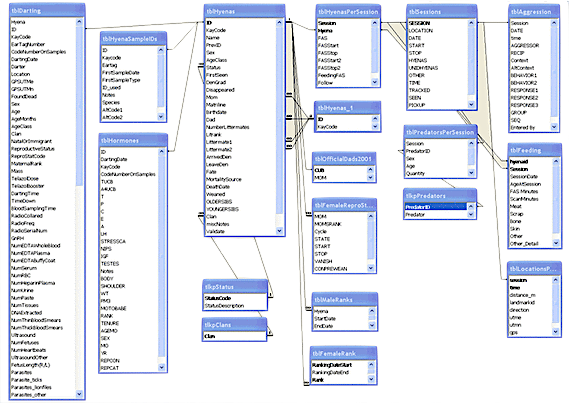

# Session 6: Data Servers on the Cloud 

## Introduction

Data servers (like Relational Databases) can be a powerful tool for even small research projects.   When we say "Data Servers" or "Data Systems"  we mean any server with data processing capabilities that you connect to with a client to send data, commands and receive results.   The most widely used and classic example is the relational database management system (RDBMs) invented in the 1970s, but there are many other types.  A central advantage of data servers is ability to handle many conncurrent connections.  Connections can be from many users, a web application serving many uers, or many other concurrent processes.    Like other systems (such as VMs, File storage servers, big data tools, etc), these data systems don't require cloud computing, but cloud companies offer database services such taht with a few clicks you can have a server that would take a week to provision and years to maintain.  A data server could be a productive addition to your cloud architecturee, or the central aspect of your fellowship project.  

I have use databases with many research projects that had significant data entry burden requiring many work-hours of students typing in data, or shared systems.   

## Readings

- [Introduction to Data Servers on the Cloud](data_servers_intro_for_researchers.html) Slide Presentation 

- [Chapter 4. Databases](https://textbook.coleridgeinitiative.org/chap-db.html) From the free textbook "[Big Data and Social Science: Data Science Methods and Tools for Research and Practice](https://textbook.coleridgeinitiative.org/)" by Foster, Ghani, Jarmin, Kreuter and Lane.  The book itself could be a valuable resource for learning about the data science methods that you may se on the cloud.  

- Textbook Chapter 3s: Blog Post from eScience: [Azure’s new CosmosDB Planet-Scale Database](https://esciencegroup.com/2017/07/31/azures-new-cosmosdb-planet-scale-database/)

**Difference between SQL and 'NoSQL' style databases**

Towards DataScience blog [Introduction to Databases for Data Scientists](https://towardsdatascience.com/databases-101-introduction-to-databases-for-data-scientists-ee18c9f0785d)  *Note this blog post may require a free account but reading in an incognito or private window worked for me*

A description of SQL vs NoSQL from a company called xplenty [Which Modern Database Is Right for Your Use Case?](https://www.xplenty.com/blog/which-database/)   *this has many adds/pop-ups but is a good read*

## Activities

Azure offers a database user interface for your computer called [Azure Data Studio](https://docs.microsoft.com/en-us/sql/azure-data-studio/download-azure-data-studio?view=sql-server-ver15) and has a tutorial for using, but you need to create a database server first.   

If you are interested in using SQL for your project, consider the following two activities based on the Open Source database system [Postgresql](https://www.postgresql.org/)

1. [Quickstart: Create an Azure Database for PostgreSQL server by using the Azure portal](https://docs.microsoft.com/en-us/azure/postgresql/quickstart-create-server-database-portal)
    - I suggest using a password rather than ssh key for now to make it easier, but not recommend for long-term use
    - record the admin user name and password you used when creating the database
    - in the Azure portal, visit the Postgresql Database resource page, and look at the connection strings page to use in the next tutorial
2. [Quickstart: Use Azure Data Studio to connect and query PostgreSQL](https://docs.microsoft.com/en-us/sql/azure-data-studio/quickstart-postgres?view=sql-server-ver15)
3. Delete the database in your resource group when you have finished with the tutorial.  If you would like to estimate costs for using database, keep it for a few days, then visit the "Cost Analysis" page of your resource group in the Azure portal.  SQL services can get expensive quickly compared to VMs, but installing and running postgresql server software is a daunting task and comes with security risks.  

Using a Database Server in the cloud has many layers so if you are interested in using SQL feel free to reach out for help provisioning and  connecting to a SQL system.   

#### References

A list of the commands you may use to manage a database for the Postgresql variety: https://zaiste.net/posts/postgresql-primer-for-busy-people/

#### Optional : Data Analytics on the Google Platform

Google Offers a service called "BigQuery" which does not require you to create a server, only an account.  It can process huge amounts of data, and has several datasets available for free.  It also has 

You may try BigQuery for free in their Sandbox, with only a Google Account.  If you have a gmail account, use that to log in with an incognito/private browser window.   You may try your msu.edu email but it may or may not work. 

*In the following tutorial you may ignore mentions of "firebase" which is another database offering for web apps from google*

[Using the BigQuery sandbox ](https://cloud.google.com/bigquery/docs/sandbox)

If you are a python user, Google offeres a free notebook service called "Co-Lab" and you can connect to both google drive and big query from Colab.  

- getting started with Colab : https://colab.research.google.com/notebooks/intro.ipynb   Log-in to Colab using https://colab.research.google.com/   
- intro to BigQuery in Colab: https://colab.research.google.com/notebooks/bigquery.ipynb
- Complex tutorial examining periodicity in weather data: https://cloud.google.com/blog/products/data-analytics/whats-the-weather-like-using-colab-to-get-more-out-of-bigquery

*Google Colab + Google BigQuery + GoogleDrive* is definitely cloud computing but not in the sense we usually think about it as these are all SAAS level services, chained together via a cloud computing backdrop.  

