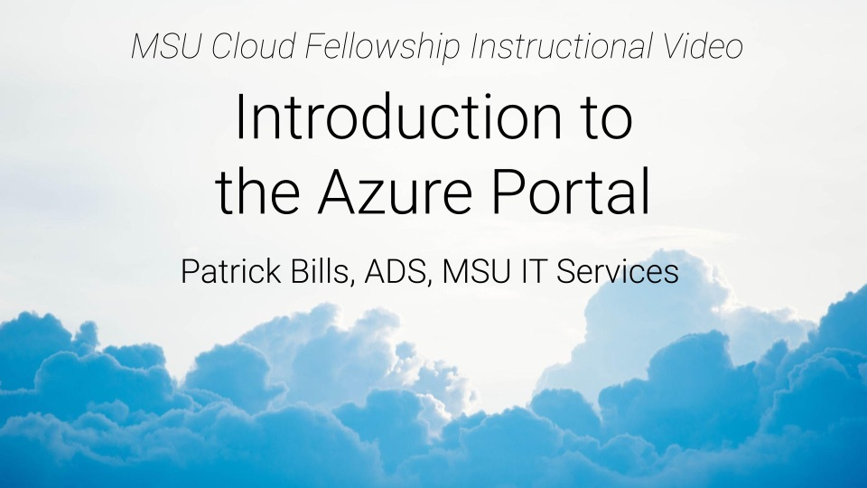
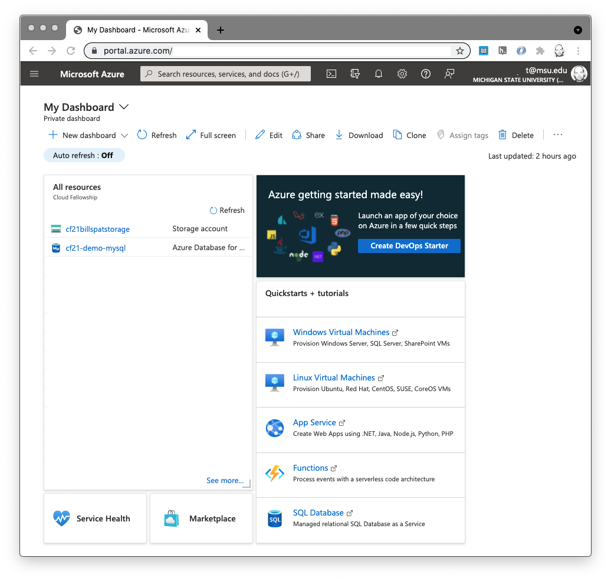

# Exercise: Azure Portal Walk-through and Storage account creation

**MSU Cloud Fellowship** {align='right'} 

## About 

This is an exercise and introduction to the web interface to manage Microsoft Azure cloud services.   Prior to doing this exercise, please read  [Azure Organization](azure_organization.md) For more background on how azure is structured.   

For definition of terms used in this walkthrough , refer to our [Cloud Glossary](../cloud_glossary.md) 
including "[resource](../cloud_glossary.md#resource)", "[azure resource manager](#)" and "[resource group](../cloud_glossary.md#resource_group)"  or our [list of cloud references](../references) for introduction to cloud computing. 

For this activity we'll be using the web interface which Azure calls the "Portal" but that is only one of [several ways to interface with Azure](intro_to_cloud_interfaces.md), but it can be a great place to start exploring and trying new services.    Many of the activities you can accomplish in the portal you can accomplish with the other (command line or code) interfaces. 

Azure's own overview of the Portal is here: https://docs.microsoft.com/en-us/azure/azure-portal/azure-portal-overview  Please refer to that as well as this material.   

## Orientation to the Azure Portal

The link above is to a video that walks through the description and tutorial steps below, hosted on  MSU MediaSpace ( requires MSU Log-in)

This assumes you have an Azure account and a valid subscription.   For the purposes of this introduction, we assume that your account currently does not have ability to create a new subscription, resource group, 

1. Log-in to https://portal.azure.com with your MSU Netid.   
    1. If you  are a current member of the fellowship and you have difficulty logging in, please [contact us](../contact.md) right away. 
1. orientation: dashboard view. 
   Azure portal first presents a "dashboard" which is organized into panels that show some aspect of your cloud account.  You may alter the panels on this dashboard  to show you the services and aspects of azure that are most important to you.   For information on how to create customize your dashboard, see "[Create a dashboard in the Azure portal](https://docs.microsoft.com/en-us/azure/azure-portal/azure-portal-dashboards)."    In the standard, default version of the dashboard the first panel is a list of resources.  If you have not created any resources yet you won't see anything.  We will explorer resources later in this introduction.   
   The standard dashboard panes are a list of your current resources (which may be in multiple resource groups), an advertisement with a link to learn about some new Azure service, and more links to create things the Azure has decided are most important to you.   We will focus on the "All Resources Pane"
   If you click on anything here you can almost always use the back button to get back to the dashboard, or use the menu (described below)
1. Top Bar Menu: the top menu ( three horizontal bars) is are links to many of the things also on the main dashboard. The "home" view is not the same as the dashboard but is a list of links to things Azure guess you may want to create, and a list of all of your resources.   If you click "resource groups" in this list, you should see only one resource group (if any) unless you've been added to others or a different subscription. 
1. Search bar: in the middle of the top of the screen is white box in which you can type search terms include the kind of resource you want to see or create, or part of the name of specific resource you've created.    This is what I use to create and find resources most of the time (and rarely use the links provided), more on that later. 
1. Shortcut buttons: the next few icons are short cuts to other functionality in the portal: 
    - cloud shell: see (link TBD)
    - directories: about your subscription
    - notifications: alerts when things change (when they are created, deleted)
    - settings : most will not be valuable unless you create many resources, but feel free to change these, although do not change your email address
    - help/support
    - feedback : to the Azure people

1. A note about portal navigation:  When you click anything in the portal, it creates a new window without reloading the browser and with an **X** at the top right.  This mimics a "close window" function and You can use the X return to the dashboard, or you may simply use the menu and go to where you need to  

Notice that like most things there are 4-5 ways to get to anywhere.  

## Creating storage account with the Azure portal

Note: It's ok if you would like to repeat this tutorial, there will be minimal costs and you may delete the resources you create (instructions for deleting at the end). 

You don't need to know about Cloud storage to complete this tutorial.  This is simply an exercise to see how to create something use the Azure portal, and cloud storage is a benign (and very inexpensive) resource to use an example.  You need a place to keep your stuff for a long time (persist your data) and cloud storage is a durable and inexpensive system for storage nearly unlimited files (or 'objects' in cloud terms).    However as we will discover cloud storage is not the same as "disk storage" and works differently.  Hence you need a storage "account."

**Requirements:**

  * An Azure Account with valid subscription
  * A Resource group

*All members of the current cloud fellowship cohort have these things*

### Tutorial Steps. 

1. Log-in to the Azure portal if you have not already:  https://portal.azure.com
1. Click the menu (top left, three horizontal bars) to open it
1. Select "home" from the menu - this ensures we all have the same view
1. In the upper part of the screen is a list of "Azure Services" : click "create a resource" \
   <i>Yes we could have click "storage accounts" instead but we want to demonstrate how to use the next screen...</i>
1. This "create a resource" screen is where you can create almost any service Azure offers, and additional services created by third-parties or companies that are not Microsoft.   When you are starting, ensure you are creating a service from Microsoft (we'll show you how in the next step)
1. Note there are now two search bars: one at the top of the screen, and on a bit lower titled "Search services and marketplace" - use that second search bar
1. in the lower search bar, type "Storage account"   Note that "storage" alone lists many other kinds of resources. 
1. You may see a list of several services, select (click) the first one labelled "Storage account" (icon looks like a spreadsheet).   
1. The description of the service will say the provider, which should be Microsoft, if not go back using the back button and search for storage account again. 
1. Click "create"
1. The azure resource creation screens mostly work like this:   there are so many settings Azure has split these up into groups which are listed horizontally across the top.   You may work though these by clicking each group, OR finish a screen, and click "Next.." button on the bottom of the form.   At any time you may click "Review and Create" and if you've missed some crucial setting, Azure will not let you create the resource without fixing it.  We will go page-by-page for these settings
1. Basics: 
    1. Subscription: Cloud Fellowship
    1. Resource Group: Select your resource group (you may only have the one) \
        You may see a "create new" link below that but it may not work and for this tutorial we using an existing resource group
    1. Storage Account Name:   This name must be unique for this region in azure, so Use your NetID for part of the name
        * replace "NETID" with your MSU NetID here:  "cf21NETIDstorage"   e.g. cf21billspatstorage
        * If you are repeating this tutorial, simply add a "2" or "cf21billspatstorage2"
        * some resources have restrictions on naming.  Next to storage account is an "i" in a circle that has more information.  For storage accounts, they must be unique in region, and only numbers and  lowercase letters are allowed.  I don't know if Non-US letters are allowed (e.g.箱)
    1. Region (Location):  You may leave US East, or click to select something closer to MSU (e.g. North Central US)
    1. Performance: Standard
    1. Redundancy: change from GeoRedundant to "Locally Redundant" (LRS) although we won't see a different, LRS is cheaper \
       - beneath that, leave the "make read access...." box checked. 
    1. Click "next...Advanced"
1. Advanced: Leave all of these settings as-is.   
1. Networking: leave all of these settings as-is
1. Data Protection: leave all as is.  These settings allow you to recover files up to 7 days after deleting or over-writing
1. Tags
   - tags are optional but highly recommended.  Tags are notes to yourself about the resource, use them for metadata.  
   - At MSU ADS we always have a tag with the key "created by" and value the netid of the creator.   
   - You may consider using a tag like "project" with value for the project if either 1) a project may have multiple resource goups or 2) a resource group would have multiple projects.     
   - tags can be added and removed at will from resources without altering the resource, so add as many tags as you want when starting to see how they may work
1. Review and create
    - review gives you a chance to double check your settings before committing
    - click "create"
1. Deployment
    - Azure calls the process of creating cloud resources a "deployment."   This term comes from the software engineering process of first "building" an application or utility (or "compiling" which is often not necessary for scripting languages like Python or R) and then moving that application onto the IT servers that make it available.  On your own computer you download software that is already "built" (e.g. MS Word) and installing it is a form of deployment.   
    - Deployment takes a while as the Azure Resource Manager takes your order and runs the code to generate the cloud resource you've described. 
    - You may leave this page and the deployment will continue in the background.   
1. finish and review
    - When the deployment is complete, in the top bar of the Azure portal, You'll see a number badge on the  "Notification" icon indicating the number of messages you have (probably just 1 ).   Click on the Notifications icon to show this message.   
    - the message should be something like: 
            Deployment succeeded
            Deployment 'resourcename_12345678901234' to resource group 'group name' was successful.
    - "Go to Resource" button will open the Portal page with options for the resource
    - "Pin to Dashboard" will create a  new tile that is a shortcut to this resource on your dashboard for easy access.   If you want to experiment with dashboard arranging then it's ok to click this and easy to remove later from your Portal Dashboard (it will be added to the bottom)

1.  Examine Resource (storage )
    We have not talked about how storage works but the storage resource page is a good example to learn how the Portal is organized.  

    1.  If you didn't already click "go to resource", open the top menu and click "home"
    2. the Portal "Home" has a list of "recent resources" and this should be at the top.  
    3. Click on this new cloud storage to view aa
    
## About Portal "Resource" Pages

Most cloud resources in the portal have a list of categories on the left side, and pages for each category in the center.  The first page is the "Overview"  which has the resource group, subscription, and other info important for that resource.   this followed by the "Activity Log" showing how the resource has been used.   Each of the following items on the left side is a new page of additional options to alter how the resource is configured.  For example if you click the "tags" section you see the tags you added (if any) and can modify or add new tags. 
   
Some of the options are not available on the forms when you create the resource, or the names of the options on these resource pages do not match the forms when you created the resources.   In that case you may have to use two steps to configure the resource as you like, or better consider using a programmatic [interface](intro_to_cloud_interfaces.md)

Again we did not discuss any of the characteristics of cloud storage or how to use it but you should now have enough familiarity with the azure portal to follow other tutorials to create and use storage or other resources.  

