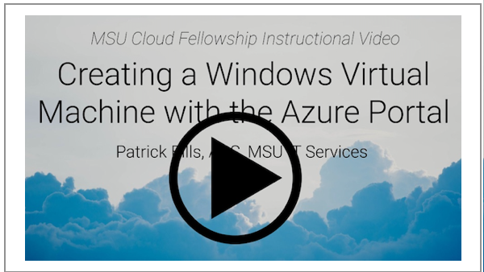
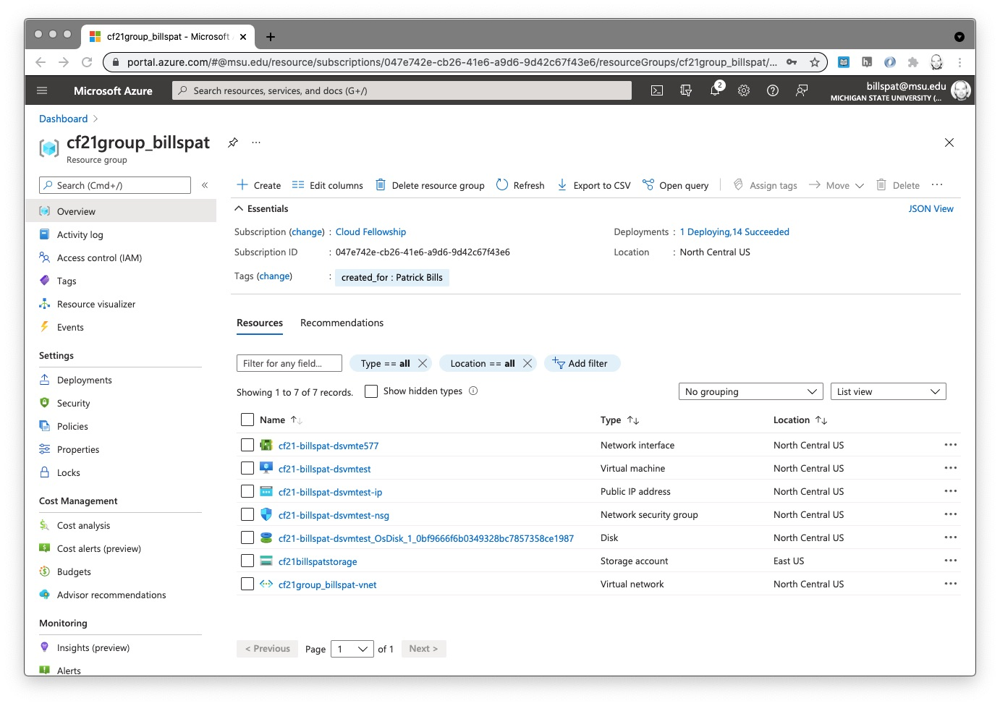
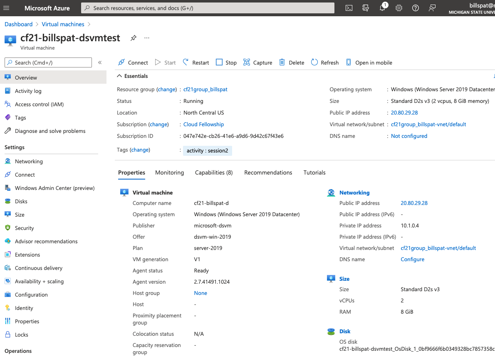
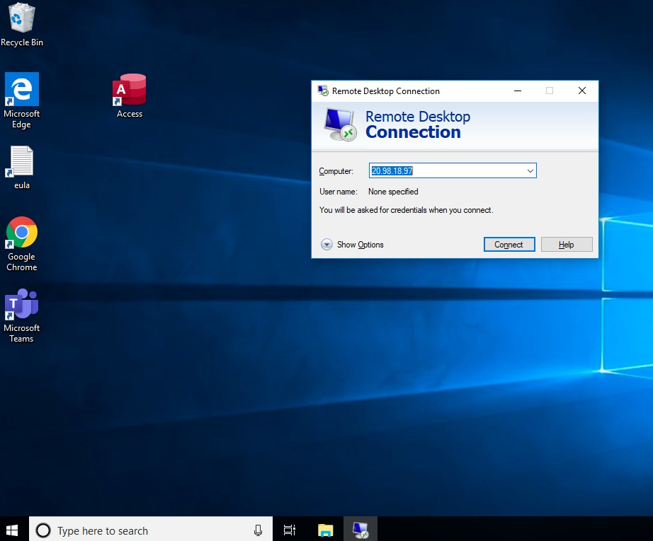

# Exercise: Creating and Connecting to a Virtual Machine (VM) for both Windows and Linux

 

*Link to Video for the <b>Windows</b> version of exercise.  On mediaspace.msu.edu which requires a log-in*

## About 

This is an exercise and introduction to creating Virtual Machines (VMs) and related resources using the Azure Portal.  

There are two nearly identical activities, and you only need complete one of them:  

  1. creating a Windows virtual machine and connecting with a graphic interface (GUI), namely Remote Desktop (rdp) to demonstrate how you may use full graphic software (like Rstudio, Matlab, etc) on a cloud computer
  1. creating a Linux Virtual machine and connection with the command line to demonstrate how you may use a terminal interface (or scripting) on a cloud computer.   

We will use a pre-configured virtual machine with software already installed for both versions.  When creating a VM you can use an Azure template and there are many of these.  The Data Science Virtual Machine (DSVM) from Azure has R, Python and many data science and statistical libraries available.   For more information about the Azure DSVM see https://azure.microsoft.com/en-us/services/virtual-machines/data-science-virtual-machines/   and for the list of tools installed, see https://docs.microsoft.com/en-us/azure/machine-learning/data-science-virtual-machine/tools-included  Azure has a new product called "Azure Machine Learning" that we may cover in a future session. 

## Requirements for both activities

You need an Azure account with an active subscription, and a resource group of your own to work in.   Fellows have these things provided.  

This exercise assumes you understand how to use the Azure Portal, which is covered in the [Azure Portal Walkthrough](azure_portal_walkthrough.md).  In addition it's helpful to know what a virtual machine is but it's not crucial to complete the exercise.  For more information on VMs see the [slides from session 2](msu-cloud-fellowship21-session2.pdf) and readings from the ["Virtual Machine Background"](index.md#readings) section

It's helpful to have basic understanding of the ["Client-Server"](cloud_glossary/#client-server) model of computing as the VM we create will be running servers (remote desktop server for Windows, and ssh command line server for Linux)

Finally we find that there are many layers of concepts related in this exercise related to IT Infrastructure, and we are happy to provde clarification as needed. 

## Creating a **Windows** Virtual Machine 

This section is based on Windows, and is recommended for everyone as it is the easy way to connect to remote machine.    For an equivalant exercise based on Linux, scroll down.  If at any point, or if you are exploring, you can't seem to get the configuration correct (or there is a validation error you can't fix), starting over will not create any resources or incur charges.   Go back to step 1 below. 

### Requirements for Windows VMs

To connect to a Windows VM desktop, it's recommend you use the Microsoft Remote Desktop client.  

  * MacOS : install the Microsoft Remote Desktop Client, only available on the App Store: https://apps.apple.com/app/microsoft-remote-desktop/id1295203466?mt=12
  * Linux users install http://xrdp.org/
  * Windows Users ensure you have the client : In the search box on the taskbar, type Remote Desktop, and then select Remote Desktop Connection.

### 1. Selecting the Resource Template 

In the [Azure Portal](https://portal.azure.com) open the top left menu, and click "+ Create a resource" option (the first option)

In the create resource search box, type "data science virtual machine"

In the options select **Data Science Virtual Machine - Windows 2019 **

The "Plans" section has a description of the template if you would like to know more. 

Click the "**start with a pre-set configuration**" option. 

### 2. select the pre-set configuration

These configurations help to select your VM size based on your activity.  We will use the default options and click **"Continue to create a VM"** 

The options do not affect the outcome of the exercise so at this step explore each option

Click "**Continue to create a VM**"

### 3. Configure the VM using the Azure Portal

The resource creation forms work as described in the Azure Portal but since we used a pre-set configuration some of the values will be completed. 

##### Basics 

1. The **Subscription** should be "Cloud Computing Fellowship" and
**resource group** should be your CF resource group (with your netid).  As we create additional resource groups for this 

1. **Virtual machine name**  Name: CF21-netid-dsvmtest
   One option is to combine the project (e.g. the fellowship), your net id, and some description of what you are doing.   In the name above, replace "netid" with your own MSU netid.   Note that different resources have different naming restrictions.  For example VMs the rules are "can be almost anything, but Azure resource names cannot contain special characters \/""[]:|<>+=;,?*@&, whitespace, or begin with '_' or end with '.' or '-' "  Note if you have an existing VM with this name, add a number 2 or other suffix.  We will delete this VM and create something more suitable in the future. 

1. **Region**  Select "(US) North Central US"

1. **Availability Options** select "No infrastructure Redundancy required"  
   this option is for critical infrastructure that needs to withstand a serious outage (e.g. if a hurricane affects a data center).  
   You may also see an "availability zone" option appear (perhaps with an error message *"The value must not be empty"*).  Selecting ""No infrastructure Redundancy required" in the availability zone will remove the "availability zone" field and error message. 
1. **Image** should be "Data Science Virtual Machine - windows..."   if this is change you may 
1. **Azure Spot Instance**  leave unchecked.   
1. **Size**   You can leave the size that is currently selected, which is based on the pre-set configuration from the previous step. 
   This is how you select the specifications for [CPU](../cloud_glossary/#cpu) and memory.  The size you for this exercise doesn't matter for the outcome, but it will show prices which may be interesting.  If you click this drop-down menu you may see some other sizes and prices.  The Monthly price assumes 24 hour/day operation.  Your price to experiment will often be less than $1.00  
1. **Administrator Account**
   Just like you need to log-in to your own computer, you must create a user account for the VM.   Select a User name and account that you will easily remember, because you will need it to log-in to the new VM. 
    * username : use any user name you will easily remember, perhaps your netid
    * password : something you can remember, but is complex to be secure.  Do **not** use your MSU password or any other passwords you use
1. **Licensing**  Unlike Linux, Windows requires a license, and this option are for organization with an arrangement with Azure.   Leave this box unchecked and Azure will add the extra charges (a few cents per hour) for the use of Windows.    

#####  Disks and Other Settings

For this exercise we'll be using the default values for almost all the pages except for **Basics** page.    However you are encouraged to look through these options to see what is involved in creating a virtual machine.  The [Azure VM documentation](https://docs.microsoft.com/en-us/azure/virtual-machines/) covers many of them.   For example a VM requires several networking components.   The good news is that Azure will name and create these for you, which will see.  

##### Tags

For this exercise, using tags will be essential for identifying which components go to which VM.  If you need more information see [session 2 page](index.md)  for a readings about tags.   Do the following: 

1. Click "tags" in the top row of options (just before 'review and create')
1. In the first row, For **Name**, type `activity` and for the **Value** type  `session2_vm` or similar unique value. 
1. click "review and create" 

##### Review and Create

If there are errors the form name will have a red dot next to it.  Go back to that form and see what may be the issue. 

If the Validation passed, it will display the approximate hourly cost to use this VM.  Mine says `0.1920 USD/hr`

Click "Create" and the deployment will start.  It will take at most 15 minutes.  

You should kkip down the the **Viewing VM Resources** section below/ 

## Optional:  Creating a **Linux** Virtual Machine

This sections is nearly identical to the section above with Windows, but uses Ubuntu Linux, and does not use a graphical interface (although with some work this is possible). 

#### Requirements

To connect to Linux you need an terminal or command line interface with an `ssh` client software.  If you have used the MSU HPC, this is the same method for connection.  

  * On Mac, the Terminal.app has ssh
  * On Modern version of Windows, the cmd.exe command prompt has an `ssh` command built in
  * Linux desktop/laptops come with an ssh client

### Creating a Linux Virtual Machine

If at any point, or if you are exploring, you can't seem to get the configuration correct (or there is a validation error you can't fix), starting over will not create any resources or incur charges.   Go back to step 1 below. 

#### 1. Selecting the Resource Template 

In the [Azure Portal](https://portal.azure.com) open the top left menu, and click "+ Create a resource" option (the first option)

In the create resource search box, type "data science virtual machine"

In the options select **Data Science Virtual Machine - Ubuntu 20.04**

#### 2. Configure the VM using the Azure Portal

The resource creation forms work as described in the Azure Portal but since we used a pre-set configuration some of the values will be completed. 

##### Basics 

1. The **Subscription** should be "Cloud Computing Fellowship" and
**resource group** should be your CF resource group (with your netid). 

1. **Virtual machine name**  Name: dsvm-YOURNETID-ccf22
   Use your actual NetId , for example "dsvm-billspat-ccf22"
   
   Note that different resources have different naming restrictions.  For example VMs the rules are "can be almost anything, but Azure resource names cannot contain special characters \/""[]:|<>+=;,?*@&, whitespace, or begin with '_' or end with '.' or '-' "

   Note if you have an existing VM with this name, add a number 2 or other suffix.  We will delete this VM and create something more suitable in the future. 

1. **Region**  You may select "(US) North Central US" or any other US-based region.   
1. **Availability Options** select "No infrastructure Redundancy required"  
   this option is for critical infrastructure that needs to withstand a serious outage (e.g. if a hurricane affects a data center).  
   You may also see an "availability zone" option appear (perhaps with an error message *"The value must not be empty"*).  Selecting ""No infrastructure Redundancy required" in the availability zone will remove the "availability zone" field and error message. 
1. **Security Type** Leave as 'standard'
1. **Image** should be "Data Science Virtual Machine - Unbuntu.."   if this is changed you may have to select it again from the list.   Any Linux image is fine for this tutorial as 
1. **Run with Azure Spot discount**  leave unchecked.   
1. **Size**   You can leave the size that is currently selected, which is based on the pre-set configuration from the previous step.    
   This is how you select the specifications for [CPU](../cloud_glossary/#cpu) and memory.  The size you for this exercise doesn't matter for the outcome, but it will show prices which may be interesting.  If you click this drop-down menu you may see some other sizes and prices.  The Monthly price assumes 24 hour/day operation.  Your price to experiment will often be less than $1.00   Click "see all sizes" if you are feeling adventurous --  there are maybe 100 options.  (click the  `[x]` in upper right to close the size selector window)
1. **Administrator Account**
   Just like you need to log-in to your own computer, you must create a user account for the VM.   
   1. **Authentication Type**  For the purpose of this exercise, select "password"  SSH Keys are strongly recommened but to keep this simple we will use a password. 
   1. **UserName** Select a User name and account that you will easily remember, because you will need it to log-in to the new VM. You can use your MSU NetID for your username so it's easy to remember.

   1. **password** : something you can remember, but is complex to be secure.  Do **not** use your MSU password or any other passwords you use
 

#####  Disks and Other Settings

For this exercise we'll be using the default values for almost all the pages, except for '**Basics**' page.    However you are encouraged to look through these options to see what is involved in creating a virtual machine.  The [Azure VM documentation](https://docs.microsoft.com/en-us/azure/virtual-machines/) covers many of them.   For example a VM requires several networking components.   The good news is that Azure will name and create these for you, which will see.  

##### Tags

Using the Azure portal to create VM creates several resources (up to 12).  Using tags will be essential for identifying which components go to which VM. This is the metadata associated with these resources.  I suggest using a tag like "activity" to indicate which of our activities was used to create these resources.   

1. Click "tags" in the top row of options (just before 'review and create')
1. In the first row, For **Name**, type `activity` and for the **Value** type  `session2`
1. click "review and create" 

##### Review and Create

If there are errors the form name will have a red dot next to it.  Go back to that form and see what may be the issue. 

If the Validation passed, it will display the approximate hourly cost to use this Linux VM.  Mine says `0.0730 USD/hr`

Click "Create" and the deployment will start.  It will take at most 15 minutes.  

Linux Users continue to the next section

## **Viewing VM Resources in your Resource group (Windows and Linux)**

*While the deployment is in progress you may explore the operation details or click any of the resources that have been created.*   

1. Open your resource group in the portal:  
    1. click the portal menu on the top left, and select "resource groups"
1. From the list, select your CF21 group. 
1. When the deployment is finished, you should see several new resources 
    * They will have the same name prefix "CF21netid-dsvm" but may have a suffix indicating the kind of resource (e.g. CF21-netid-dsvm1-ip 
    * The second column is the "type" which helps identify what they are

{:target="_blank"}
*click for a large view in a new tab/window*

1. Select the item with type "virtual machine" and click on the name to open its resource page (for example, cf21-billspat-dsvmtest item in the screenshot above)

## The VM Resource Page

To see the details for your virtual machine, click the VM in your resource group if you haven't already. 

{:target="_blank"}
*click for larger view*

There are many details here but some immediate things to notice: 

  * in the top row are buttons to connect, start, restart and stop the vvm.   
  * in the top, "essentials" section the  "status" should be "running."
  * on the right side is the assigned [IP address](../cloud_glossary/#ip-address) which you need to connect.   Highlight and copy and paste this address.   If you click the link on the address, it will take you to a new resource page just for the IP address (which is a distinct resource assigned to this VM resource)
  

## Connecting

### Connecting to a **Windows** VM using Remote Desktop Protocol (RDP) client

You may connect to this VM running the Windows operating system with either graphical desktop, a command line connection, or both.  

Every VM created in Azure has an "IP Adress" or internet address, and we use this to connect to.  

The following Azure documentation describes how to connect to a Windows VM:   
https://docs.microsoft.com/en-us/azure/virtual-machines/windows/connect-logon

Here are more detailed instructions: 

There is a 'connect' link above the 'essentials' list, and a connect link on the left side - they both go to the same place. 

**Connect with RDP**  (remote desktop protocol)  is a Microsoft method for connecting to the graphical desktop.  For Mac/Linux requires additional software (mentioned at the beginning of this page).  

  * In the Azure portal:
  
    - click "connect" and select "rdp" if it isn't already.  
    - click "**download RDP file**" button and save the `.rdp` file anywhere on your computer that you find it again

  * On your computer:
    - after it's downloaded, find the  `.rdp` file and double click to open it which should start your remote desktop software.   Mac users must have installed the Microsoft Remote Desktop client app 
    - ignore any security or error messages, click "connect"
    - Enter the user name and password you used when you created the VM. 

  * Alternatively you may also open your RPD software, create a new connection, and copy the IP address listed in the portal, in the Azure VM.  and paste the IP address that is listed on the resource page for the VM.   

  * When you connect, if the VM is not running, you will get an error message.  Here is what the Windows screen looks like: 

   

   This is because we are using a temporary certificate but it is secure.  Click "Yes" 

  * Enter the Username and password you used when  configuring the VM in the "Basics" section above.  
    * you may be able to simply enter the user name and password directly
    * If not, in the  Windows Security window, select More choices and then Use a different account. Enter the credentials for an account on the virtual machine and then select OK.  If the user account you entered does not work, you may have to put your user account in domain\username form, and in this case, the domain is the name of the virtual machine and it is entered as vmname\username, with a back-slash in-between, and with the same password. 

Once you connect, you may see Windows starting up and installing things.  Feel free to close any windows.  Once the installations are finished, you may use the machine as you would any other windows computer.  If you type Rstudio in the search box, you may launch an  Rstudio session on this remote computer.    It also has Python, many python libs and Jupyter notebook.  

We will cover how to transfer code and files to a VM in a later session. 

When you finished with your remote session you may simply close the remote windows (leaving the VM running.  See below for how to turn it off and delete it. 

**Optional: Connect to the Windows DSVM with ssh**  

This windows machine has an SSH Server running, and the security settings from the pre-configured version allow connections from SSH.   If you are familiar with ssh and the command line, you may start the CMD.EXE on your windows computer, or the Mac Terminal, and enter
`ssh <username>@<ipaddress>`

Where the username is the user you put for your VM when you created it, and the Public IP address is listed on the VM Resource page.   

This is similar to how you connect to the MSU HPC, if you are HPC user. 

You will be asked to add the host to your list hosts, and enter the password you used when you created the VM. 

When you log-in you will be connected to the Windows command prompt (e.g. `C:\Users\username>` 

To Exit, type `exit` at the command prompt. 

**Next Steps:** For information on turning off the VM and for eventually deleting the VM, scroll down below the Linux section as these operations are the same in the Azure portal for Linux or Windows virtual machines.  

### Connecting to a **Linux** VM using SSH

We will connect and use this remote VM running the Linux operating system with a command line connection.  It is possible to use a graphical connection but requires additional setup beyond the scope of the short exercise.  

In addition this assumes you have some familiarity with using the command line and starting your terminal program.  

There is a 'connect' link above the 'essentials' list, and a connect link on the left side - they both go to the same place. 

**Connect with SSH**  

this is the standard method of connecting with ssh, but we've included as much detail as possible for those who are new to using ssh. 

  * On the main "overview" page of the VM resource, find the "Public IP Address" on the top right side.   Copy this IP address to the clipboard, or make a note of it.   Mine was 20.98.28.63.   Note that these VMS also have an internal IP address that start with 10.x.x.x that will not work for connecting from your laptop.  Use the Public IP address.  not all VMs *have* a public IP address but this one will.  
  * also make a note of the User ID and password you used to create the VM above
  * side note, in the "connect" form of the VM resource pages, it describes how to use an ssh key,  even though we did not create an ssh key when we created a VM.  If you did not create an ssh key, you do not need to follow these instructions. 

  * on your desktop/laptop, start your terminal program on MacOS/Linux or `cmd.exe` if you using Windows. 
  * Enter the command as displayed, which is something like `ssh vmusername@vmipaddress`   In my case, my command is `ssh patbills@20.98.28.63`
  * If this is the first time connection, you'll get the standard ssh warning `"The authenticity of host '20.98.28.63 (20.98.28.63)' can't be established."` simply say "yes" and enter
  * Enter the password you used when  configuring the VM in the "Basics" section above.  (note that ssh does not show any key movement or * when you type a password)
  * it takes a while to connect for the fist time as the VM configures software and prepares your user account

You may use the machine as you would any other linux computer. For more information about what software is installed, see 
We will cover how to transfer code and files to a VM in a later session. 

When you finished with your remote session you may simply close the remote windows (leaving the VM running.  See below for how to turn it off and delete it. 

## Starting and Stopping the VM (both Windows and Linux)

There are three ways to "stop" or turn off a VM.  
1. when connected to it, e.g. in the remote desktop, use  Windows to turn it off.  The VM is then "stopped."   In a Linux ssh session you may use a command like `sudo shutdown -h now`   When the Operating system is shut off, and hence tthe VM is not running, but it is still "allocated."  When you turn it back on, it will come on immediately. 
1. Use the Azure portal to "stop" the VM which shuts down Windows (gracefully if possible) and 'deallocates' the VM.  Restarted the VM appears to be the same process, but Azure must allocate resources first to run it, then power it up.  This is cheaper then the first method in the long run
1. Delete it.   
 
### Stopping (deallocating) the VM with the Portal: 

1. Go to the resource page for the VM, if you are not already. 
  * If you are just entering the portal, find your resource group, find the VM in your resource group (identified as a VM in the "type" column of the list of resources), and click to open the resource page. 
  * The Status field near the top of this screen will indicate running or stopped.  
1. Find the Start and Stop buttons near the top of this screen and click "stop" if the machine is running. 
1. There is a warning about losing your IP address, with a check box to reserve it.
    * If you plan on deleting the VM now, click "ok"
    * If you plan on restarting the VM and reconnecting, first check the box "reserve the IP" then click OK
    * The default is to use a "dynamic" address which is assigned every time you turn on the VM
    * When using a dynamic address, you must copy/paste the ip address, or re-download the RDP connection file everytime you restart the machine
    * the solution is to use a "Static IP" either when you create the VM, or assigning one after the VM is created. and checking the box does so. 
    * you can also convert to a static IP with the portal, but it is not a straightforward process, see https://docs.microsoft.com/en-us/azure/virtual-network/virtual-networks-static-private-ip-arm-pportal
    * Pricing for a static ip is here: https://azure.microsoft.com/en-us/pricing/details/ip-addresses/ which as of now is $0.0036/hour which is charged even if the VM is turned off.  That is approx $2.70/month
1. It's a good idea to leave VMs in a "stopped (deallocated)" state if you are not using them for computations or providing a service, just as you would turn off or put your laptop to sleep.   The main reason for this is for security.  

## Deleting the Resources (both Windows and Linux)

1. Open the Resource group as above
1. When creating resources using the template as we did above, the resources associated with this VM will all start with the same prefix, so they are easy to identify.   Select them with checkboxes, and click the "Delete" button which is on the top right of the screen (not the "delete resource group" button)
1. If it's not obvious which resources are all included, you may also use the "tag" you created to filter what is listed and only show those with the same "tag."  For more information see https://docs.microsoft.com/en-us/azure/azure-portal/manage-filter-resource-views .  If you add filter on tag, then you may select all the items that are shown, and delete those. 
1. after selecting confirm the deletion by typing "yes"

Creating resources just to delete them may seem wasteful however we will cover how to save a "snapshot" and/or "image" of your VM's disk so that you may re-use any work to install and configure software withtout incurring charges.  

## More References

Azure has very abbreviated versions of this exercise if you would like another perspective.  They assume you can create your own resource group (which you don't have the ability to do currently in the fellowship)  

https://docs.microsoft.com/en-us/azure/machine-learning/data-science-virtual-machine/overview#next-steps  

**Data Science Use Case Tutorials from Azure: **

  * Windows: This tutorial uses products that Azure no long supports, and for Windows users they really push to use their "Azure Machine Learning" product.   However the Windows DSVM offers a really fast way to get access to a windows desktop graphical interface  https://docs.microsoft.com/en-us/azure/machine-learning/data-science-virtual-machine/vm-do-ten-things 
  
  * Linux: https://docs.microsoft.com/en-us/azure/machine-learning/data-science-virtual-machine/linux-dsvm-walkthrough

If you follow these, just remember to delete the resources you create when you are done exploring

---

Return to the [Session 2 page](index.md)

