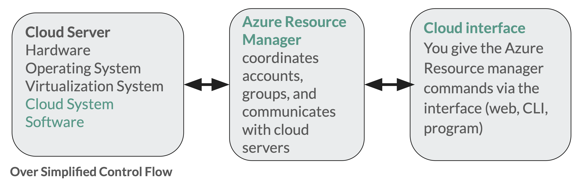

# Interfacing with Cloud Services

Cloud Services are by design DIY or on-demand and hence need a programming interface to create cloud resources.  This is only possible becuase inside the data center, computer configuration can be done completely with code, also knows as "Infrastructure as Code" (IaC).  [Amazon's insight](https://en.wikipedia.org/wiki/Amazon_Web_Services#Founding_(2000–2005)) was that they could slap a website on top of that, put a system for tracking (metering) usage, and sell it.  

All of the cloud companies as their base use a web interface, so-called [REST API](https://en.wikipedia.org/wiki/Representational_state_transfer).   Knowing the details of REST is not important but it's often the basis for all of the other style of interfaces.  

Here is an [example web api URL for weather forecast](https://www.7timer.info/bin/astro.php?lon=113.2&lat=23.1&ac=0&unit=metric&output=json&tzshift=0), with parameters for coordinates, units and format of output

  `https://www.7timer.info/bin/astro.php?lon=113.2&lat=23.1&ac=0&unit=metric&output=json&tzshift=0`  

Very few researchers would ever use the REST api directly, instead would use the web interface or even better the command line or programming language interface which achieves the same goal with less work.  

In Azure, everything you could possibly create is called a "resource:" a machine, a data service, a single network address.   The system to work with Azure resources is the "Azure Resource Manager" or ARM and the primary interface for the Resource Manager is their web (REST) api.    You may see references to resources in documentation and that means any web doo-dad. 
 
## Summary of Cloud Interfaces

This summary is focused on Microsoft Azure, but the other cloud companies have similar concepts.   In addition to this guide, Chapter 1 of our text "Cloud Computing for Science and Engineering" has an excellent description and examples of these interfaces with examples from AWS.  See the section of that chapter titled "Accessing a cloud service" in https://s3.us-east-2.amazonaws.com/a-book/Orienting.html

### Graphical Web Interface

Most people want a graphical user interface, and for azure that's the "Portal" or https://portal.azure.com.  For Google cloud it's the "console" and for AWS it's also called the console.  See below for an introduction to using the portal.   Note that the Azure portal and Google console both have web-based terminals that allow you to use the CLI directly in the web interface.    

###  Desktop Applications

Azure provides some desktop applications for working with a few of the widely used cloud services : 

  * Azure Storage Explorer: https://azure.microsoft.com/en-us/features/storage-explorer/  
    Can create cloud storage and upload/download data.  We will use that for our session on Storage
  * Azure Data Studio:  https://docs.microsoft.com/en-us/sql/azure-data-studio/what-is-azure-data-studio?view=sql-server-ver15   
    Can connect to and work with data systems (such as databases ) that are on your computer, on a system on campus, or hosted in Azure

### Command Line

For those not familar with the command line at all, see https://www.digitalocean.com/community/tutorials/an-introduction-to-the-linux-terminal for linux and for Windows Powershell see https://programminghistorian.org/en/lessons/intro-to-powershell

The command line interface is a great way to interact with cloud services because it's imperative and all options are specified in a single command.   With the web interface, you may have to hunt through the user interface to find the checkbox for an option, but for command line 

Azure has two command line interfaces:  The "CLI" which is based on Linux and will work in any linux or Mac terminal (or shell script) and the "Powershell" interface which is for Windows Powershell users.   Since Powershell has been ported to Linux and Mac and the Linux Shell  and Azure CLI can also be used on Windows, so both are operating system independent but in practice, Windows users use powershell and everyone else uses the CLI.   Your choice depends on the kinds of other systems you'll be working with.  For example, the MSU HPC uses Linux command shell  but Windows servers and other Windows services like SQLServer work well with Powershell. 

### SDK : Software Developer Kit

A "software developer kit" is simply a collection of utilities, libraries/packages and documentation for a specific language to work with a specific service.  All the cloud vendors have SDKs, and they all have SDKs for Python.    SDK simply means you can create, delete, interact with cloud services from your program.

Why leave python or R if don't have to?

#### Python SDK

All cloud vendors have SDKs to work with Python.   After installing the SDK, you import the libraries and issue commands to create resources, then use those cloud resources to do work via client libraries (either Azure libraries or others).   Azure has extensive documentation for using Python: https://docs.microsoft.com/en-us/azure/developer/python/?view=azure-python

Example Azure code to create cloud storage, compared with how you would see the resources in the azure portal, and similar commands using the CLI : https://docs.microsoft.com/en-us/azure/developer/python/azure-sdk-example-storage?tabs=cmd

Note that Azure also has a service "Azure Cloud Functions" that run python that are not the same thing as the SDK.  These are 'serverless' resources (similar to AWS Lambda), which we will learn about later in the course. 

Both AWS and Google Cloud have Python SDKs, and probably other vendors.  

### REST

Knowing the details of REST is not important but it's the basis for all of the other style of interfaces.  

Here is an [example web api URL for weather forecast](https://www.7timer.info/bin/astro.php?lon=113.2&lat=23.1&ac=0&unit=metric&output=json&tzshift=0), with parameters for coordinates, units and format of output

  `https://www.7timer.info/bin/astro.php?lon=113.2&lat=23.1&ac=0&unit=metric&output=json&tzshift=0`  

The parameters to the weather data fetch program are lon, lat, ac, unit, output=json, tzshift, and they are embedded in the URL itself.   

This is caled a "request," and using a web API often requires sending parameters not just sin the URL, but as an attachment or in the 'body' of the request.  Browsers don't have an automatic way of doing that, so we use scripts (python Requests library) or special programs for testing Web APIs that can send parameters and data in the request body.  

This is a good explanation of REST and part 2 describes the details. 
 
https://medium.com/extend/what-is-rest-a-simple-explanation-for-beginners-part-1-introduction-b4a072f8740f

The Azure REST api is a an interface to the Azure Resource Manager via the web.   Requests sent can get information about your resources, or create new resources, just like the portal, the command line and the SDKs.   Those other interfaces typically translate to the REST API.  Knowing about it may help diagnose why your method for interfacing with Azure is not working but not necesary to learn.    For examples and more detail, see https://learn.microsoft.com/en-us/azure/azure-resource-manager/templates/deploy-rest

Few of us would ever use the Azure REST api directly, instead would use the web interface or even better the command line or programming language interface which achieves the same goal with less work.  

#### R

Unlike the other vendors, Microsoft maintains an SDK for R Users which allows you to create cloud services directly from Rstudio.  See their github pages https://github.com/Azure/AzureR and excellent documentation throughout the packages.  

### Cloud company templating frameworks

In addition to the "SDKs" for existing languages, cloud companies often have their own frameworks for using code to build (provision) infrastructure. 
For Azure, these are "ARM Templates" and for AWS it's [Cloud Formation](https://aws.amazon.com/cloudformation/). 

#### Azure: ARM templates

Azure has a system for submitting a template, or essentially a configuration file to the Azure Resource Manager (ARM) that dictates which cloud resources are to be created.   For Azure these are JSON-formatted files  that are "declaritive" (rather than procedural or imperative like Python).   The best way to understand these is to explore the many that Microsoft posts on github, and to try them.   If you do, be mindful to delete any resources you create so as not to be charged for them. 

    - Overview of ARM templates: https://docs.microsoft.com/en-us/azure/azure-resource-manager/templates/overview
    - Quick start ARM templates (github): https://github.com/Azure/AzureStack-QuickStart-Templates
 
You may see reference to "Bicep" templates.  This is simplified ARM templating language that may be easier to write, debug and maintain than the JSON format of ARM templates.  

   
#### AWS: Cloud Formation

AWS also has templating language similar to Azure Resource Manager templates called cloud formation.  If you are using AWS for your project, and want to automate the creation and deployment of resources, this may be a good option. 

**AWS Documentation:**

- [What is AWS CloudFormation?](https://docs.aws.amazon.com/AWSCloudFormation/latest/UserGuide/Welcome.html)  
- [How does AWS CloudFormation work?](https://docs.aws.amazon.com/AWSCloudFormation/latest/UserGuide/cfn-whatis-howdoesitwork.html)

## Third-party programming with Terraform

There are other ways to 'program the cloud' from companies outside of the big three.  One widely used frame is "Terraform" from Hashicorp, not affiliated with any cloud company.   The advantage to Terraform is that it's declarative in that you specific what you want, unlike say the Python or command line interface, where you have to create items with commands one at a time.  

Terraform is used by cloud professionals becuase it's designed to keep the resources youve created running and allow you to modify them in place.   If you find you are using scripting to build resources (which is great!) but your scripts are becomming combersome to maintain and your cloud architecture is complex, consider using Terraform.  

    - Terraform: https://www.terraform.io
    - Can work with any vendor including Azure
    - Often more readable than ARM templates, Syntax remarkably simple 
    - Focus on maintaining consistent systems ( declarative) 
    - Does not cover all services, but can fall back to ARM templates when necessary

## Building Cloud from Cloud

This may not be an 'interface' but is operationally similar.  It's possible to use some of the above interfaces on existing cloud services, e.g.   creating new cloud resources automaticaly from existing cloud resources.   Your cloud architecture may need different types of resources, or parameterized resources only as needed (e.g. depending data inputs, a web-gateway for cloud on demand).    

For example Azure [Logic Apps](https://azure.microsoft.com/en-us/services/logic-apps/) can create resources when they are run (e.g. provision and start a computer) and a logic app can be triggered by events such as when a new file is created, or using a web api (e.g. REST POST command that sends data and parameters).   This adds significant complexity and is only valuable for event-based systems opens up using the cloud as a big computer programming language. 

## References

See our [references page](../references) for curated Azure links.   For AWS, see 

  * [https://aws.amazon.com/tools/](https://aws.amazon.com/tools/) 
  * about the AWS CLI: https://aws.amazon.com/cli/
  * Demo Using Python Notebook with AWS: https://s3.us-east-2.amazonaws.com/a-book/s3.html
 

