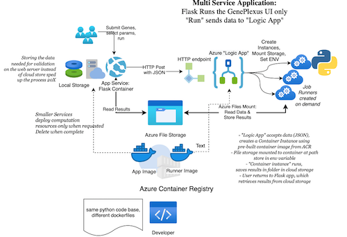
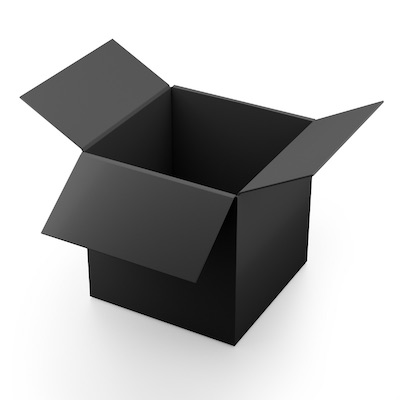

# Session 7: Serverless, Containers, and FaaS

*example real-world cloud application*

## What is "Serverless?"

There are many definitions that include more or less categories of cloud services.   The primary concept is you create an 'exectution environment' to run your code, but you don't manage any aspect of the server.  You can focus on your application or code and not the operating system. 

We will talk about two kinds of "serverless" computing: 

- Cloud Functions: running code on demand in response to a trigger or event.  This is sometimes called "Function as a Service" 
- Linux Containers: sandbox environment for running software, even more abstract than Virtual Machines, s

The relationship is the Cloud functions use Linux Containers as the basis for their architecture on Azure.  However you can use Azure Functions without working with containers or even knowing that fact but if you need extreme customization.    

## Serverless Readings

As you read these materials, do you think  "serverless" resources are IaaS or PaaS?   They sure feel like infrastructure as they require significant configuration, but run like PaaS, hence they are often called "Function as a Service." 

- Re-visit [Chapter 4 Computing as a service](https://s3.us-east-2.amazonaws.com/a-book/computing.html) 

- An additional report [Serverless Computing and FaaS](https://cloud4scieng.org/serverless-computing-and-faas/)  *"Observations about Serverless Computing, With a few examples from AWS Lambda, Azure Functions and Open Whisk"* by Dennis Gannon

### Containers

Containers are a widespread technology not just for Azure.   

* [About Linux Containers](linux_containers_and_the_cloud.md) from Pat Bills, with readings and activities

### Functions

- All About Azure Functions: https://www.serverless360.com/azure-functions

- Example pricing for Azure functions: https://azure.microsoft.com/en-us/pricing/details/functions/

[Azure Functions triggers and bindings concepts](https://docs.microsoft.com/en-us/azure/azure-functions/functions-triggers-bindings?)tabs=csharp

## Case Studies and Tutorials

**An Introduction for Academics and links to Use Case in Bioinformatics** : [Grzesik, P., Augustyn, D. R., Wyciślik, Ł., & Mrozek, D. (2021). **Serverless computing in omics data analysis and integration.** Briefings in bioinformatics, bbab349. Advance online publication. https://doi.org/10.1093/bib/bbab349](https://www.ncbi.nlm.nih.gov/pmc/articles/PMC8499876/)

## Activities

Links and activities related to containers are in the [Container Overview](linux_containers_and_the_cloud.md) page.  

For Python programmers who have used the azure commaand line: [Quickstart: Create a Python function in Azure from the command line](https://docs.microsoft.com/en-us/azure/azure-functions/create-first-function-cli-python?tabs=azure-cli%2Cbash%2Cbrowser)

*This is a long and very command line oriented tutorial which requires installation of components on your computer, or using the [CloudShell](https://docs.microsoft.com/en-us/azure/cloud-shell/overview)
 

## Fellowship Meeting

November 4, 2022 

- Discussion of Previous Weeks
- Introduction the Session materials
- Talk and demonstration: a cloud-based web application for gene function prediction: [GenePlexus: a web-server for gene discovery using network-based machine learning ](https://academic.oup.com/nar/article/50/W1/W358/6586869?login=false)
  

