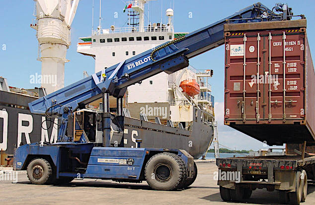
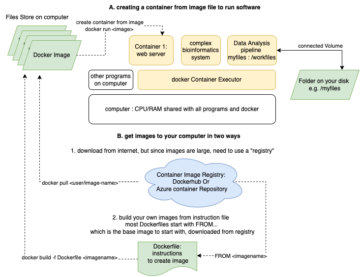

# Linux Containers, Research, & the cloud

#### For [Session 6: Serverless Cloud Computing](../session_serverless/index.md)

*The container metaphor for this kind of computing relfects how a standard-sized box can be carried on ships, trains, and trucks at different scales*

## About this material

Understading this material is not necessary to use cloud computing, and being advanced is optional for the cloud computing fellowship.  However, Linux containers are the heart of much of the cloud works, and becoming more prevelant for running complex research software.  

Container technology was invented to support IT Systems (to run servers), like many things we discussed in the first session.   However value was discovered for research (reproducibility, configuraiton management) and it's become more common to find research software and projects that provide a 'Dockerfile' and instructions for running using containers.   Some workflows, especially in bioinformatics, are complete container based.   One reason is that   containers can be run (and be useful) on your own computer, on an on-premise server, and especially in the cloud with nearly identical results.     

## VMs are great, but...

The abstraction of a "Virtual Machine" (VM) solves the problem of requiring 1-1 physcial hardware-to-server.  Now you can have one large computer that can host many smaller VMs which is more efficient.  In addition, a VM can be saved as a "virtual hard drive" and turned off, or moved to a different physical hardware, or even backedup.  Otherwise IT system administrators may have have to re-install everything over again.  

However becauase of the architecture there Virtual Machines can be unflexible.    When you created your vitual machine, you specified how much memory you needed and how much disk space you needed.   The physical machine must then reserve a part of it's memory and disk permanently, even if you your VM may not be working that hard.   One IT Manager of a virtualization system reported that most of the VMs were only using 5% of what they had reserved.  That's very inefficient!  However the people that created the VMs (people like you ) wanted to ensure they had enough compute power to get done what they needed.    Another problem is that each VM has a full copy of an operating system, like any computer.  So a physical computer, you are responsible for keeping the operating system up-to-date, secure, and free from viruses.   What if there was a way to share a large computers memory, diskspace and underlying operating system dynamically?

## Introduction to Containers

Many different groups contributed to solutions to the problems of process isolation and management including Google.  The most popular from a company called "Docker."   Docker is a company, a technology/method, software you install on your computer, and a place to host shared containers (a repository or hub)  So you may hear about "Docker containers" but this is a brand name (like "Kleenex").    On the MSU HPC we use [Singularity](https://wiki.hpcc.msu.edu/display/ITH/Singularity%3A+I.+Introduction) containers but for now focus on Docker, which works with Azxure.  

Like Virtual Machines, containers are a means to abstract a running system so that we can bundle muliple "machines" on larger equipment.   Unlike virtual machines, containers share the resources dynamically and are much more isolated.   In addition, unlike virtual machines, Docker containers can be created from a code/configuration file that specifies what goes in them.  That means someone can give you this file, and you can "run" it to create a whole system that does what you need, one time or many times.   

- you can use code to define exactly what will go into a container, making it reproducible.  Techincally you can to this with VMs with different kinds of platforms, but it's more difficult and requires more detailed knowledge of operating system
- you can run a container on any cloud service, or your laptop or even the HPC
- because you define what is installed in a container, the configuration of complex software is easier and portable.   
- The Docker company created this format to be easy to use, so you can find someone who hs written the container code file to launch your system, or if you create complex software system for your research, you could provide a container file that makes it easy for others to run yuor scientific software.   This is not uncommond for bioinformatics software.  

### How can I use it on my computer?

You can use Docker on your desktop, and launch containers and use the software in a container, which is like running a website right on your laptop.   Most likely no one else can access it, but it's great for development and testing.   

The Docker is primarily an invisible background process, hidden system files, and CLI commands.  However for Windows and Mac, the "docker desktop" wraps a user interface around those things.  

### How can I used them on the Cloud?

Azure offers several options, but to start

* [Azure Container Instances (ACI)](https://learn.microsoft.com/en-us/azure/container-instances/container-instances-overview)

* Azure alternative to "Docker hub" is the [Azure Container Registry (ACR)](https://learn.microsoft.com/en-us/azure/container-registry/container-registry-intro).   You can use the ACR to build images for you so you don't have to install docker to use them on Azure. 

### Why use containers on the cloud

The goal of using VMs and Containers can overlap.  However there are some advantages to using Container Instances : 

 -  You can create a working container instance from code without having to install anything manually as you do with a VM.   The alternatives for VM is to find an existing VM image inthe azure marketplace, or to save your disk and use that as a template for additional VMs.   
 -  You can run exactly the same software configuration on your laptop, on Azure, or on any other cloud vendor
 -  Dockerfiles can be shared with a colleague easier than sharing a VM disk image
 -  When a container instance is off, there is no charge.   Yes!   That's because resources are only allocated when it's running. 
 -  Much less to manage.  When a VM you are responsible for keeping the operation system up to date, all security patches installed and ensuring it does not get hacked.   
 -  Better security since you are not maintaining an operating system.  There are still some security implications for containers that run servers, but much fewer since you are reponsible for the application only.   

### Advantages of VMs over ACI

 - more control over networking
 - many more options for machine types and sizes.  Container instances are limited 
 - many more options for disk configurations, etc
 - if you need to optimize performance or need very high performance from a single machine, VMS may be better choice
 - more familiar and so conceptually easier to use
 - can use Azure VM Scale Sets for multiple VMS (there is probably a similar service for )

### What can I use it for?

Following this process, you may find that a large research software project has a "Dockerfile" as part of it's code base.   This is a set of instructions for building everything needed to run the software using containers.  You may find that two commands `docker build` and `docker run` are all you need to have a working environment to use a program.   
 
Containers often are for running complex cloud-based applications that have manu components:  Web servers, database servers, message managers, etc.   Using containers allows companies to manage the components of the **application** instaed of all of the hardware and operating systems of the **systems.**  This is a major shift and why it's called "serverless.   

However containers can be useful for batch computing, that is running a calculation or building a machine learning model.   With servers, you start a container and leave it running.   But you can also "docker run," the containers could take input, do their work, and exit.    Everything needed to complete the calculation is bundled in the container, and does not pollute your computer with special software installs.  

### What is Kubernetes?

You will see a technology called Kubernetes mentioned everywhere.    This is for "orchestrating" many containers: helping to create and launch many complete interrelated components, let components talk to each other, keeping them running, reporting on their healht, and for most companies now, scale them automaticaly by creating replicas to meet demand.     Kubernetes is not widely used in research because of it's complexity but if you have complete workflows or systems to maintain it may be worth investigating.  

You don't need Kubernetes to run single or even a couple of containers, but could is known to be utilized for large compute clusters, running spark, or even HPC-type workloads.    For small numbers of containers There are other solutions (such as [Azure Batch](https://learn.microsoft.com/en-us/azure/batch/batch-technical-overview) ), or you can connect them yourself with coordinating code.   Using Kubernetes can be an entire career but may be necessary when building complex systems with containers.    

## Reading

[An Introduction to Containers](https://www.suse.com/c/rancher_blog/an-introduction-to-containers/) from a company called "Rancher" which sells software manage containers

Chapter 6: [Using and Managing Containers](https://s3.us-east-2.amazonaws.com/a-book/containers.html) from our textbook "[Cloud Computing for Science and Engineering](https://cloud4scieng.org/)" 

Great series introducting [Docker For Science](https://www.hifis.net/tutorial/2020/09/23/getting-started-with-docker-1.html)  This is better than what I've written so far!  

Another very colloquial but helpful introduction to containers from "MyGreatLearning.com" : https://www.mygreatlearning.com/blog/docker-tutorial/ 

This describes a really important use case of containers which is to enhance reproducibility.  How often have you been told "this code works for me" but you are unable to run it, or it's a huge task to get everything installed just right.   Reproducibility is crucial software development requires a complex developer or running environment.  Even simply the differences between Mac, Windows, and Linux!   

[Docker Overview](https://docs.docker.com/get-started/overview/)

[Azure Container Service Overview](https://azure.microsoft.com/en-us/services/container-instances/#overview)

## Tutorial 

There are many many tutorials, blogs, videos, etc for Container Technology.   That didn't stop me from making one of my own, but geared for you, the researcher: [Docker Tutorial for Researchers featuring Jupyter Lab](docker_tutorial_for_researchers.md). 

## Activities

- For Windows users :   
[Get started: Set up Linux Containers on Windows 10](https://learn.microsoft.com/en-us/virtualization/windowscontainers/quick-start/quick-start-windows-10-linux?source=recommendations) and check the [Pre-requisites](https://learn.microsoft.com/en-us/virtualization/windowscontainers/quick-start/quick-start-windows-10-linux?source=recommendations#prerequisites) . Also note on Windows and _only_ windows you can run either a Linux container or a Windows container.   The vast majority of published containers, and the containers we'll be using are Linux, and that's what this tutorial covers. 

- [Quickstart: Deploy a container instance in Azure using the Azure portal](https://docs.microsoft.com/en-us/azure/container-instances/container-instances-quickstart-portal) : copy a simple web application into a container and run it on Azure.  We aren't suggesting you run a web application for your project, but almost all of the tutorials are about 

- [Docker Orientation and setup](https://docs.docker.com/get-started/)

- For Python Users: [How to Run Jupyter Notebook on Docker](https://towardsdatascience.com/how-to-run-jupyter-notebook-on-docker-7c9748ed209f)

- Jupyter Hub: running Jupyter with everything installed just right can be problematic:  The [Jupyter Stacks Project](https://jupyter-docker-stacks.readthedocs.io/en/latest/) is to create bundles to include everything you need for a particular kind of research.   Note I have not tried to get this running on Azure - could it be done?   Would it be helpful?

- *optional for shell scripters and command line users*: complete this [shell script that launches an Rstudio session on azure container instance](container_scripts/rstudio_container_script.md)
 
- Optional training activity: [Introduction to Kubernetes](https://learn.microsoft.com/en-us/training/modules/intro-to-kubernetes/) from Microsoft. 

